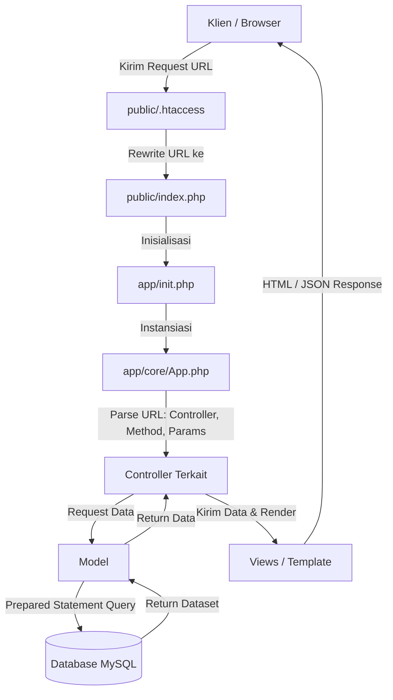

# PHP MVC - Sistem Pengelolaan Data Mahasiswa

Aplikasi web berbasis **PHP Native** yang menerapkan konsep arsitektur **Model-View-Controller (MVC)** dari dasar (*from scratch*). Proyek ini dilengkapi dengan fitur CRUD (Create, Read, Update, Delete) data mahasiswa, pencarian data, flash notification, manipulasi form modal dengan AJAX, serta konfigurasi environment menggunakan **Docker** dan **Docker Compose**.

---

## 📑 Daftar Isi

- [Fitur Utama](#-fitur-utama)
- [Tech Stack](#-tech-stack)
- [Struktur Direktori](#-struktur-direktori)
- [Alur Kerja Aplikasi (Application Lifecycle)](#-alur-kerja-aplikasi-application-lifecycle)
- [Daftar Routing & Endpoint](#-daftar-routing--endpoint)
- [Instalasi dan Menjalankan Aplikasi](#-instalasi-dan-menjalankan-aplikasi)
  - [Opsi 1: Menggunakan Docker Compose (Direkomendasikan)](#opsi-1-menggunakan-docker-compose-direkomendasikan)
  - [Opsi 2: Menggunakan Web Server Lokal (XAMPP / Laragon / Native)](#opsi-2-menggunakan-web-server-lokal-xampp--laragon--native)
- [Konfigurasi Basis Data](#-konfigurasi-basis-data)

---

## ✨ Fitur Utama

1. **Arsitektur Native MVC**:
   - **Core Routing**: Penguraian URL dinamis dengan format `BASEURL/controller/method/params`.
   - **Base Controller**: Pemuatan View (`view()`) dan Model (`model()`) secara modular.
   - **Database Wrapper**: Abstraksi koneksi PDO dengan *prepared statements* untuk perlindungan dari SQL Injection.
2. **Manajemen Data Mahasiswa (CRUD)**:
   - Menampilkan seluruh daftar mahasiswa.
   - Menampilkan detail informasi mahasiswa secara spesifik.
   - Menambah data mahasiswa baru.
   - Mengubah data mahasiswa dengan memanfaatkan AJAX untuk mengisi form modal secara otomatis tanpa reload halaman.
   - Menghapus data mahasiswa disertai konfirmasi alert.
3. **Pencarian Data (Search)**:
   - Pencarian mahasiswa berdasarkan nama secara instan.
4. **Flash Messages**:
   - Notifikasi status aksi (sukses/gagal) berbasis `$_SESSION` yang terintegrasi dengan alert Bootstrap.
5. **Containerized Environment**:
   - Konfigurasi siap pakai dengan `Dockerfile` (PHP 8.2 Apache + `pdo_mysql`) dan `docker-compose.yml` (MySQL 8.2 + Web Server).

---

## 🛠️ Tech Stack

- **Backend**: PHP 8.2 (Native MVC, PDO MySQL)
- **Database**: MySQL 8.2
- **Web Server**: Apache dengan modul `mod_rewrite`
- **Frontend**: HTML5, CSS3, Bootstrap 5.x, JavaScript (jQuery untuk AJAX handling)
- **DevOps / Container**: Docker & Docker Compose

---

## 📂 Struktur Direktori

```text
phpmvc/
├── Dockerfile                  # Konfigurasi image PHP 8.2 Apache
├── docker-compose.yml          # Konfigurasi container service web & MySQL
├── init.sql                    # Skema tabel awal & dummy data mahasiswa
├── README.md                   # Dokumentasi proyek
├── app/                        # Direktori utama aplikasi (Backend logic)
│   ├── .htaccess               # Mencegah akses langsung ke direktori app
│   ├── init.php                # Bootstrap file untuk memuat core & config
│   ├── config/
│   │   └── config.php          # Konfigurasi konstanta global & database
│   ├── controllers/            # Controller aplikasi
│   │   ├── About.php           # Halaman About & Pages
│   │   ├── Home.php            # Halaman Dashboard / Beranda
│   │   └── Mahasiswa.php       # Controller CRUD & Pencarian Mahasiswa
│   ├── core/                   # Core engine MVC
│   │   ├── App.php             # Router & URL parser
│   │   ├── Controller.php      # Base Controller class
│   │   ├── Database.php        # PDO Database wrapper
│   │   └── Flasher.php         # Helper flash message session
│   ├── models/                 # Model untuk interaksi data
│   │   ├── Mahasiswa_model.php # Query database untuk entitas Mahasiswa
│   │   └── User_model.php      # Model data user dummy
│   └── views/                  # View templates (UI)
│       ├── about/
│       │   ├── index.php
│       │   └── page.php
│       ├── home/
│       │   └── index.php
│       ├── mahasiswa/
│       │   ├── detail.php
│       │   └── index.php       # List mahasiswa + Modal tambah/ubah
│       └── templates/
│           ├── header.php      # Navigasi & asset CSS/JS header
│           └── footer.php      # Script JS Bootstrap, jQuery, & custom script
└── public/                     # Document root publik yang diakses klien
    ├── .htaccess               # URL Rewriting menuju index.php
    ├── index.php               # Front Controller (entry point utama)
    ├── css/                    # File stylesheet (Bootstrap CSS)
    ├── img/                    # Asset gambar
    └── js/                     # File JavaScript (Bootstrap, script.js AJAX)
```

---

## 🔄 Alur Kerja Aplikasi (Application Lifecycle)



1. **Front Controller**: Seluruh HTTP request diarahkan ke [public/index.php](file:///Users/abirusabil/Documents/Work/php/phpmvc/public/index.php) melalui rewrite rules di [public/.htaccess](file:///Users/abirusabil/Documents/Work/php/phpmvc/public/.htaccess).
2. **Routing & Dispatching**: [App.php](file:///Users/abirusabil/Documents/Work/php/phpmvc/app/core/App.php) membaca query parameter `url`, memecahnya menjadi:
   - `url[0]`: Nama **Controller** (default: `Home`)
   - `url[1]`: Nama **Method** (default: `index`)
   - `url[2..n]`: Nilai **Parameter** yang dikirimkan ke method controller via `call_user_func_array`.
3. **Controller & Business Logic**: Controller memanggil Model ([app/core/Controller.php](file:///Users/abirusabil/Documents/Work/php/phpmvc/app/core/Controller.php)) jika membutuhkan data dari basis data dan merender View dengan passing parameter array `$data`.
4. **Data Access Layer**: Model menggunakan [app/core/Database.php](file:///Users/abirusabil/Documents/Work/php/phpmvc/app/core/Database.php) yang membungkus PDO untuk query aman berbasis parameter binding.
5. **UI & Interaktivitas**: View menampilkan data dengan Bootstrap 5. Khusus proses update data, [public/js/script.js](file:///Users/abirusabil/Documents/Work/php/phpmvc/public/js/script.js) melakukan AJAX request ke endpoint `mahasiswa/getubah` untuk memuat data lama mahasiswa ke dalam form modal sebelum submit.

---

## 🌐 Daftar Routing & Endpoint

| URL / Route | HTTP Method | Controller & Method | Deskripsi |
| :--- | :---: | :--- | :--- |
| `/` atau `/home` | `GET` | `Home::index()` | Menampilkan halaman utama (Welcome screen) |
| `/about` | `GET` | `About::index($nama, $pekerjaan, $umur)` | Menampilkan halaman About Me dengan parameter URL opsional |
| `/about/page` | `GET` | `About::page()` | Menampilkan sub-halaman static About |
| `/mahasiswa` | `GET` | `Mahasiswa::index()` | Menampilkan daftar mahasiswa, search bar, dan modal form |
| `/mahasiswa/detail/{id}` | `GET` | `Mahasiswa::detail($id)` | Menampilkan detail lengkap seorang mahasiswa berdasarkan ID |
| `/mahasiswa/tambah` | `POST` | `Mahasiswa::tambah()` | Memproses penambahan data mahasiswa baru |
| `/mahasiswa/getubah` | `POST` | `Mahasiswa::getubah()` | API Endpoint (JSON) untuk mengambil data mahasiswa berdasarkan ID (AJAX) |
| `/mahasiswa/ubah` | `POST` | `Mahasiswa::ubah()` | Memproses perubahan/update data mahasiswa |
| `/mahasiswa/hapus/{id}` | `GET` | `Mahasiswa::hapus($id)` | Menghapus data mahasiswa berdasarkan ID |
| `/mahasiswa/cari` | `POST` | `Mahasiswa::cari()` | Memfilter dan menampilkan mahasiswa berdasarkan kata kunci nama |

---

## 🚀 Instalasi dan Menjalankan Aplikasi

### Opsi 1: Menggunakan Docker Compose (Direkomendasikan)

Proyek ini telah dikonfigurasikan dengan multi-container Docker (Apache PHP 8.2 & MySQL 8.2).

1. **Jalankan Container**:
   ```bash
   docker compose up -d --build
   ```
2. **Akses Aplikasi**:
   Buka browser dan akses alamat:
   ```
   http://localhost:8080/public
   ```
3. **Akses Database MySQL (Opsional)**:
   - **Host**: `127.0.0.1` (atau `localhost`)
   - **Port**: `3307`
   - **Database**: `phpmvc`
   - **User**: `root` / `myuser`
   - **Password**: `rootpassword` / `mypassword`

4. **Menghentikan Container**:
   ```bash
   docker compose down
   ```

---

### Opsi 2: Menggunakan Web Server Lokal (XAMPP / Laragon / Native)

1. Pindahkan folder proyek ke document root server lokal Anda:
   - XAMPP: `htdocs/phpmvc`
   - Laragon: `www/phpmvc`
2. Buat database baru di phpMyAdmin / MySQL dengan nama `phpmvc`.
3. Import file [init.sql](file:///Users/abirusabil/Documents/Work/php/phpmvc/init.sql) ke dalam database `phpmvc`.
4. Sesuaikan konfigurasi pada file [app/config/config.php](file:///Users/abirusabil/Documents/Work/php/phpmvc/app/config/config.php):
   ```php
   define('BASEURL', 'http://localhost/phpmvc/public');

   define('DB_HOST', 'localhost');
   define('DB_USER', 'root');
   define('DB_PASS', '');
   define('DB_NAME', 'phpmvc');
   define('DB_PORT', '3306');
   ```
5. Akses aplikasi melalui browser:
   ```
   http://localhost/phpmvc/public
   ```

---

## 🗄️ Konfigurasi Basis Data

Skema tabel yang digunakan (`mahasiswa`):

```sql
CREATE TABLE IF NOT EXISTS mahasiswa (
    id      INT AUTO_INCREMENT PRIMARY KEY,
    nama    VARCHAR(50),
    nrp     VARCHAR(50),
    email   VARCHAR(100),
    jurusan VARCHAR(100)
);
```
